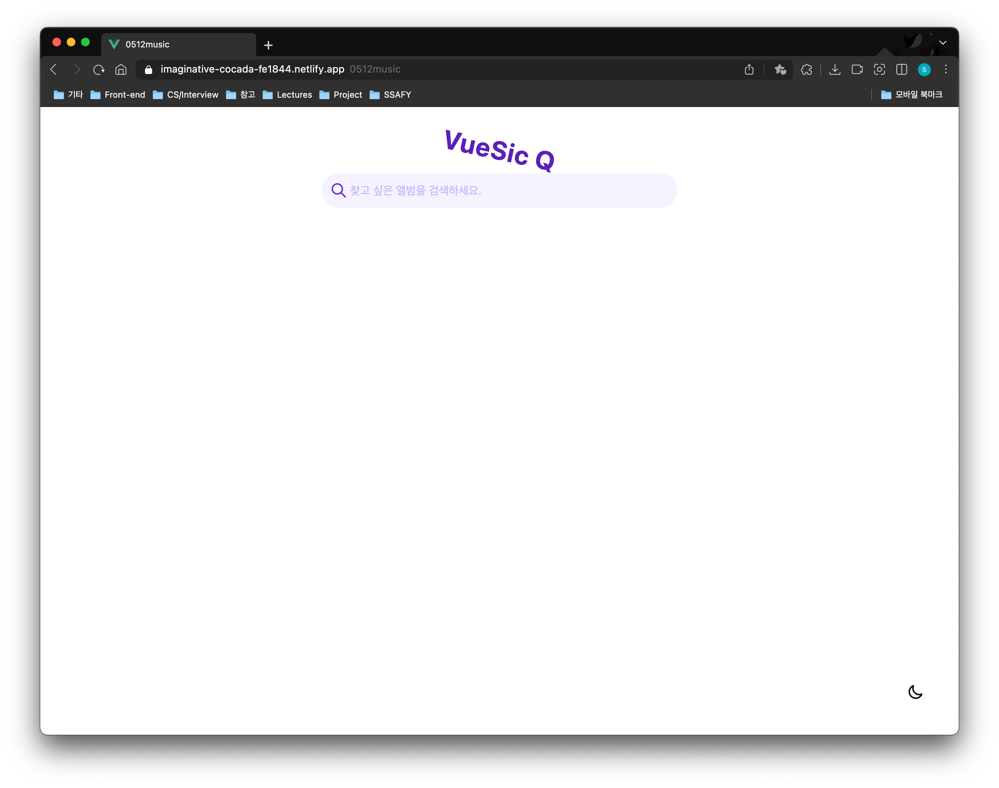
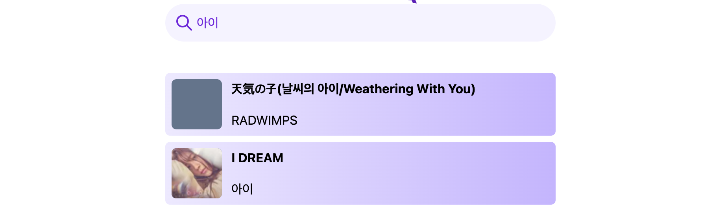

⏰ **시행 날짜:** 2022.05.12

🍀 **개발환경:** Visual Studio Code

👄 **개발언어:** **html, css, JavaScript, Vue, Vuex TailwindCSS, Axios**, **Lodash**

**🛠 개발 도구**

- Visual Studio Code
- Google Chrome Browser
- last.fm API

---

## 🎯 구현 기능

### 1. 검색창 (DOM & Event)

- 사용자가 input에 value를 입력할 경우, 해당 입력값을 기준으로 데이터를 실시간 요청합니다.

### 2. API 요청 (Ajax)

- 사용자가 입력한 검색어(keyword)를 포함하여 앨범 검색 요청을 보냅니다.
- (참고 문서) https://www.last.fm/api/show/album.search
- 앨범 검색을 위한 ajax 요청에는 `axios`를 활용합니다.

### 3. 검색 결과 (DOM & Event)

- 검색 결과를 input 창 아래에 띄웁니다.
- 검색 결과가 나타나기 전 skeleton loader를 띄워 사용자에게 데이터가 요청 중임을 알립니다.
- 무한 스크롤을 통해 페이지 스크롤 시 새로운 데이터를 서버에 요청합니다.

### 4.  실시간 검색 요청

- Enter 버튼 없이 사용자가 검색어를 입력하면 **debounce**를 통해 일정 시간 이후 자동으로 서버에 요청을 보냅니다.

### 5. 무한 스크롤

- 검색어와 관련된 모든 데이터를 한 번에 요청하는 것이 아니라, intersectionObserver API를 활용하여 무한 스크롤을 구현합니다.
- 가장 마지막 자료가 viewport에 나타나는 경우, 서버로 한 번에 서버에 20개씩 데이터를 요청합니다.

### 6. Dark & Light 모드

- tailwindCSS를 활용하여 dark 모드와 light 모드를 구현합니다.
- 최초 속성은 사용자의 환경에 맞추어 setting 합니다.


---

## 🌏 실제 페이지

### 🖥 메인 페이지

<div align="center">
 
</div>


### 🔎 검색어 입력

- skeleton loading 을 통해 데이터를 요청 중임을 사용자에 알립니다.
- 무한 스크롤을 통해 20개씩 데이터를 서버로 요청합니다.

<div align="center">
 
</div>


- 검색한 앨범 중 앨범 이미지가 없는 경우, UI가 손상되지 않도록 대체 속성을 사용하였습니다.

<div align="center">
	
</div>


### Dark & Light 모드

- 토글 버튼을 통해 Dark & Light 모드를 쉽게 전환할 수 있습니다.

<div align="center">
	
</div>

### 앨범이 없는 경우

- 앨범이 없을 경우, 앨범이 없음을 사용자에게 알립니다.

<div align="center">
	
</div>

---

## 🚨 Error

- App.vue에서 SearchForm 컴포넌트와 AlbumList 컴포넌트가 동위 컴포넌트이기 때문에 SearchForm에서 App.vue에 event를 전달하고 다시 AlbumList 컴포넌트로 props 형태로 데이터를 전달하는 것보다 VueX를 활용하는 것이 이점이 있을 것이라 판단.
- SearchForm을 통해 입력된 value를 VueX의 mutations을 호출하여 state로 keyword를 저장.
- 이후 데이터를 요청하고 무한 스크롤을 하는 것은 전역적인 상태 관리가 필요 없기 때문에 AlbumList 컴포넌트에서 바로 수행
- 검색어의 변화에 따라 AlbumList 컴포넌트에서 API 서버로 데이터를 요청하기를 희망하였으나, 요청이 되지 않는 문제가 발생.

### 해결책

- computed와 watch 속성을 이용
- computed 속성을 통해 store의 state의 변화에 따라 state 값을 저장
- watch 속성을 사용하여 watch 속성은 computed의 변화를 감지하고, computed가 변화할 경우에 fetchAlbumList 메서드를 실행시키며, 검색어가 변경됨에 따라 서버로 데이터 요청이 가능해짐.

```javascript
computed: {
    keyword() {
      return this.$store.state.keyword;
    },
  },
  watch: {
    keyword() {
      if (!this.keyword.trim()) return this.resetAlbumList();
      this.fetchAlbumList(this.keyword);
    },
```

